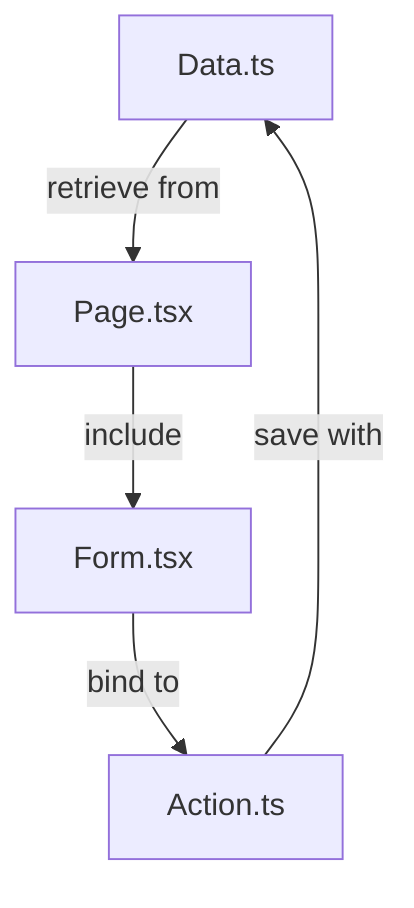

## Explaination of Hook

Take the following code as illustration.

The `useFormState` declare the `increment()` function as the `formAction` and set the `state` default value to `0`.

The `<form>` will show up the current `{state}` and bind the formAction to `{formAction}` and that is `increment()`;

```js
import { useFormState } from "react-dom";

async function increment(previousState, formData) {
  return previousState + 1;
}

function StatefulForm({}) {
  const [state, formAction] = useFormState(increment, 0);
  return (
    <form>
      {state}
      <button formAction={formAction}>Increment</button>
    </form>
  )
}
```

## Data Flow
- app/lib/data.ts
- dashbord/invoices/[id]/edit/page.tsx
- app/ui/invoices/edit-form.tsx
- app/lib/actions.ts



## Next.js App Router Course - Starter

This is the starter template for the Next.js App Router Course. It contains the starting code for the dashboard application.

For more information, see the [course curriculum](https://nextjs.org/learn) on the Next.js Website.
