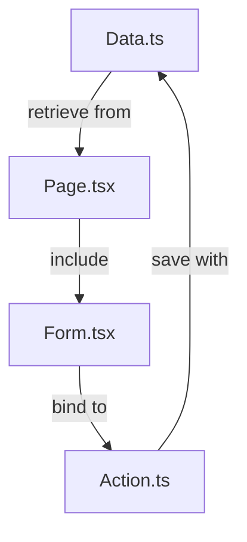

## How to run this project
```
npm run dev
```


## 20250602 seed problem
https://github.com/vercel/next-learn/issues/792
https://github.com/vercel/next-learn/issues/769#issuecomment-2195370386


### Solution
After I have done some research, the current [next.js/learn](https://nextjs.org/learn/) has updated the way to do seed.  It rely on the `/seed` folder with `route.ts` to achieve.


In my version, I need to rely on the `package.json` defined `seed` command to do so.


Run `npm run seed` will help in seeding the database.


## Run the program
```bash
pnpm dev
```


## PNPM
By using `pnpm i`, it will show.  I need the bcrypt for db seed. run the recommanded command.
```bash
╭ Warning ───────────────────────────────────────────────────────────────────────────────────╮
│                                                                                            │
│   Ignored build scripts: bcrypt, bufferutil, unrs-resolver, utf-8-validate.                │
│   Run "pnpm approve-builds" to pick which dependencies should be allowed to run scripts.   │
│                                                                                            │
╰────────────────────────────────────────────────────────────────────────────────────────────╯
```


## My Local NPM selection
In my Kubuntu, I need to use nvm to pick node version before i can use npm
```bash
maxwkf@darkhole:~/Systems/maxwkf/maxwkf/nextjs-dashboard$ pnpm i
Command 'pnpm' not found, did you mean:
 command 'npm' from deb npm (9.2.0~ds1-2)
Try: sudo apt install <deb name>
```


```bash
nvm use 18
```


## Explaination of Hook


Take the following code as illustration.


The `useFormState` declare the `increment()` function as the `formAction` and set the `state` default value to `0`.


The `<form>` will show up the current `{state}` and bind the formAction to `{formAction}` and that is `increment()`;


```js
import { useFormState } from "react-dom";


async function increment(previousState, formData) {
 return previousState + 1;
}


function StatefulForm({}) {
 const [state, formAction] = useFormState(increment, 0);
 return (
   <form>
     {state}
     <button formAction={formAction}>Increment</button>
   </form>
 )
}
```


## Data Flow
- app/lib/data.ts
- dashbord/invoices/[id]/edit/page.tsx
- app/ui/invoices/edit-form.tsx
- app/lib/actions.ts



## Next.js App Router Course - Starter


This is the starter template for the Next.js App Router Course. It contains the starting code for the dashboard application.


For more information, see the [course curriculum](https://nextjs.org/learn) on the Next.js Website.


## User Password
The user password can be found in script/seed.js


